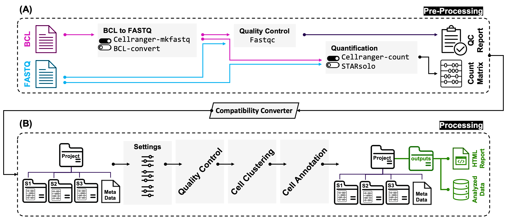

[](http://www.repostatus.org/#active)
[](https://www.tidyverse.org/lifecycle/#stable)

<p align="center" width="100%">
 
</p>

# CellBridge

**CellBridge** is an automated and versatile workflow meticulously designed to
simplify and expedite the standard procedures entailed in scRNA-seq analysis,
eliminating the need for specialized bioinformatics expertise. CellBridge
harnesses cutting-edge computational methods, integrating an array of advanced
functionalities. It encompasses various crucial steps in scRNA-seq analysis,
starting from the initial conversion of raw unaligned sequencing reads into the
FASTQ format, followed by read alignment, gene expression quantification,
quality control, doublet removal, normalization, batch correction,
dimensionality reduction, clustering, identification of cell markers, and
accurate cell type annotation. CellBridge provides convenient parameterization
of the workflow, while its Docker-based framework ensures reproducibility of
results across diverse computing environments. 

See [ToBridge](https://github.com/Sanofi-Public/PMCB-ToBridge) Github for the
pre-processing step of the data.

<p align="center" width="100%">
 
</p>

---

## Workflow Inputs

<details>
<br>

The pipeline inputs (required) is one folder containing:

1) A metadata file which should be in `CSV` format and contain
demographic and experimental information. The metadata file can be either
`sample_based` or `cell_based`. NOTE: 
  * one column containing the name of samples is required in both metadata types and must be named `sample`; 
  * for `sample_based` metadata, each row should be associated with one sample; 
  * for `cell_based` metadata, each row should be associated with one cell; 
  * the column with cell-id (barcode) information must be named `cell`; 
  * the column name `sample_id` is reserved for the pipeline.
2) CellBridge accepts different types of input data for analysis. The first type
is the widely used output of the `10X` Genomics Cell Ranger pipeline: the trio of
the matrix of UMI counts, the list of cell barcodes, and the list of gene names.
Additionally, Cellbridge accepts Hierarchical Data Format (`HDF5`, `h5`) file
formats that are generated by the Cell Ranger pipeline. CellBridge also accepts
count matrix files in `txt.gz` format, which contain the scRNA-seq gene expression
quantification information. The feature-barcode matrices can be generated by any
microfluidic-, microwell plates-, or droplet-based scRNA-seq technology.
Finally, CellBridge accepts previously processed Seurat RDS (R Data
Serialization) objects as the input. NOTE:
  * data corresponding to each sample must be provided in separate folders. 
  * the name of each folder must be the same as the sample names provided in the `sample` column of the metadata file.

</details>

---

## Docker Images

<details>
<br>

The pre-built images are available in the `pmcbscb` (Precision Medicine and
Computational Biology – Single Cell Biology) Docker Hub repository. They can be
seamlessly pulled by:

```
docker pull pmcbscb/tobridge
```
```
docker pull pmcbscb/cellbridge
```

Note: for details about pre-processing step, visit
[ToBridge](https://github.com/Sanofi-Public/PMCB-ToBridge) Github page.

</details>

---

## Available Flag Options

<details>
<br>

The extensive documentation for flag options is embedded within the workflows.
For a review of the flags, please execute:

```
docker run pmcbscb/tobridge tobridge --help
```
```
docker run pmcbscb/cellbridge cellbridge --help
```

For detailed information about the available flag options in `cellbridge`, refer
to our up-to-date HTML manual:
[cellbridge-flags](http://htmlpreview.github.io/?https://github.com/Sanofi-Public/PMCB-CellBridge/blob/master/cellbridge_flags.html)

Note: for details about pre-processing step, visit
[ToBridge](https://github.com/Sanofi-Public/PMCB-ToBridge) Github page.

</details>

---

## Instructions for Running the Workflow on the Demo Dataset

<details>
<br>

#### Get fastq demo files

Users can download FASTQ files from one of the publicly-available data sets on
the 10x Genomics support site. This example uses the 1,000 PBMC data set from
human peripheral blood mononuclear cells (PBMC), consisting of lymphocytes (T
cells, B cell, and NK kills) and monocytes:

``` 
mkdir sandbox
```
``` 
cd sandbox
```
``` 
wget https://cf.10xgenomics.com/samples/cell-exp/3.0.0/pbmc_1k_v3/pbmc_1k_v3_fastqs.tar
```
``` 
tar -xvf pbmc_1k_v3_fastqs.tar
```
``` 
cd pbmc_1k_v3_fastqs
```

#### Get the reference transcriptome and metadata

``` 
wget https://cf.10xgenomics.com/supp/cell-exp/refdata-gex-GRCh38-2020-A.tar.gz
```
``` 
tar -zxvf refdata-gex-GRCh38-2020-A.tar.gz
```
``` 
wget <path_to_github_raw>/metadata.csv
```

#### Assuming the images have already been pulled (see above), execute the workflows

``` 
docker run -it --rm -v ${PWD}:/data:z pmcbscb/tobridge:latest tobridge \
                                                    --flag1 flag1 \ 
                                                    --flag2 flag2 \ 
                                                    --flag3 flag3 \ 
                                                    --flag4 flag4 \ 
```
``` 
docker run -it --rm -v ${PWD}:/data:z pmcbscb/cellbridge:latest cellbridge \
                                                    --project project-demo \
                                                    --species hs \
                                                    --tissue pbmc \
                                                    --metadata sample_based
```

Note: sharing files between the host operating system and the container requires
you to bind a directory on the host to the container mount points using the `-v`
argument. There is one available mount points defined in the container named
`data`. In the example above the current directory `${PWD}` was used and not an
absolute notation. If you intended to pass a host directory, use absolute path.

Note: for details about pre-processing step, visit
[ToBridge](https://github.com/Sanofi-Public/PMCB-ToBridge) Github page.

</details>

---

## Workflow Outputs

<details>
<br>

As a result, the pipeline produces one `outputs` folder containing three files,
each of which is tagged by a 15-character unique identifier (UI).

1) An HTML report (`<project_name>_cellbridge_v<x.y.z>_<UI>_summary.html`),
containing quality metric plots, tables, and several other plots providing an
overal view of the scRNA-seq data analysis outcomes. 
2) An RDS object (`<project_name>_cellbridge_v<x.y.z>_<UI>_final-object.rds`) 
containing the final seurat object with all accosiated metadata and miscellaneous 
information.
3) An RDS object (`<project_name>_cellbridge_v<x.y.z>_<UI>_middle-object.rds`)
containing all intermediate files required to repreduce the html summary.

CellBridge generates a unique identifier (UID) for all three output files. The
UID is a 15-character alphanumeric code (consisting of upper and lower-case
letters and numbers) that is assigned to all three output files and projected on
the HTML summary report. The UID serves as a tracking mechanism for the data in
case the same dataset is processed multiple times with different input
parameters. The UID ensures that the output files can be easily identified and
distinguished, allowing investigators to easily trace their analysis and results
back to the specific run and set of parameters used and minimizing confusion and
errors in data management.

</details>

---

## Perform only QC

<details>
<br>

In most of the cases, it is hard to tell the optimal parameter values for best
QC in advance. The `only_qc` argument will help users to take a look at the
overall metrics of the data in advance. After examination of all the QC metrics,
user can run the pipeline with the optimal parameter values.

</details>

---

## Contact

<details>
<br>

For help and questions please contact the [cellbridge's maintenance team](mailto:nima.nouri@sanofi.com).

</details>